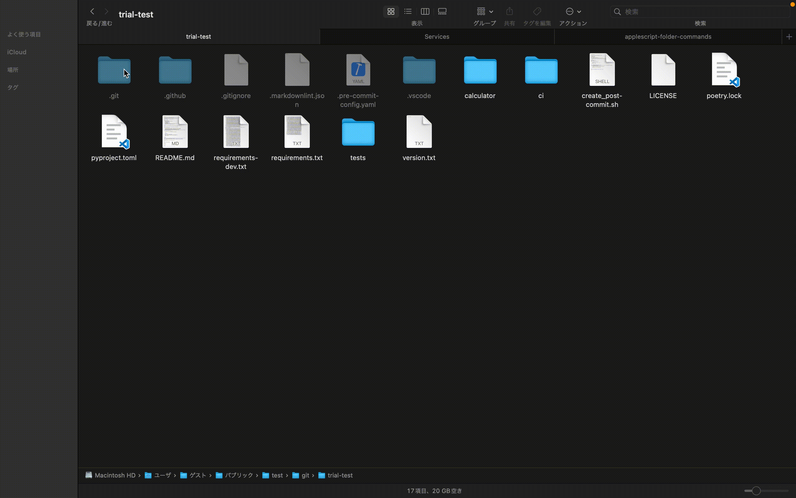

# TOC

- [TOC](#toc)
- [ghRepoCloneBranch.workflow](#ghrepoclonebranchworkflow)
  - [Demo](#demo)
  - [Prerequisite](#prerequisite)
  - [Detail](#detail)
  - [Usage](#usage)
  - [Note](#note)
  - [Verified Version](#verified-version)
- [ghRepoClone.workflow](#ghrepocloneworkflow)
  - [Detail](#detail-1)
  - [Prerequisite](#prerequisite-1)
  - [Usage](#usage-1)
  - [Note](#note-1)
  - [Verified Version](#verified-version-1)
- [gitPull.workflow](#gitpullworkflow)
  - [Demo](#demo-1)
  - [Prerequisite](#prerequisite-2)
  - [Usage](#usage-2)
  - [Verified Version](#verified-version-2)

# ghRepoCloneBranch.workflow

AppleScript to clone the specified repository and branch based on the list of repositories obtained by the "gh" command and "jq" command

## Demo


## Prerequisite

- You must have installed GitHub CLI.
- Must be authenticated by "gh auth login"
- You must have installed jq

## Detail

- Repository list is executed by ShellScript(~/scripts/gh_list.sh)
- Clone the specified repository under the folder where the quick action was executed

## Usage

1. Execute the following command to create "~/scripts/gh_list.sh"(#1)

    ```bash
    mkdir -p ~/scripts
    echo "/usr/local/bin/gh repo list --limit 100 | awk '{print \$1}'" > ~/scripts/gh_list.sh
    chmod +x ~/scripts/gh_list.sh
    ```

2. Save "ghRepoCloneBranch.workflow" to "~/Library/Services" folder
3. Select the folder you want to save, right click and select "Quick Actions" > "ghRepoCloneBranch". (#2)(#3)

## Note

- #1. The maximum number of repositories to be acquired should be changed as necessary.
- #2. If you do not see "ghRepoCloneBranch", open Finder and select "Services" > "Service Settings" from the "Finder" menu,
      Make sure "get github repository" is checked in the "Files and Folders" section.
- #3. It will not save in username/repository format.
      It will not be saved in username/repository format.
      If you want to save in username/repository format, set USER_REPO_FMT to ture.
- #4. If the paths of the "gh" and "jq" commands are different, change them in property.

## Verified Version

- macOS Ventura
- version 13.6.1

---

# ghRepoClone.workflow

AppleScript to clone the specified repository based on the list of repositories obtained by the "gh" command

## Detail

- Repository list is executed by ShellScript(~/scripts/gh_list.sh)
- Clone the specified repository under the folder where the quick action was executed

## Prerequisite

- You must have installed GitHub CLI.
- Must be authenticated by "gh auth login"

## Usage

1. Execute the following command to create "~/scripts/gh_list.sh"(#1)

    ```bash
    mkdir -p ~/scripts
    echo "/usr/local/bin/gh repo list --limit 100 | awk '{print \$1}'" > ~/scripts/gh_list.sh
    chmod +x ~/scripts/gh_list.sh
    ```

2. Save "ghRepoClone.workflow" to "~/Library/Services" folder
3. Select the folder you want to save, right click and select "Quick Actions" > "ghRepoClone". (#2)(#3)

## Note

- #1. The maximum number of repositories to be acquired should be changed as necessary.
- #2. If you do not see "ghRepoClone", open Finder and select "Services" > "Service Settings" from the "Finder" menu,
      Make sure "get github repository" is checked in the "Files and Folders" section.
- #3. It will not save in username/repository format.
      It will not be saved in username/repository format.
      If you want to save in username/repository format, set USER_REPO_FMT to ture.
- #4. If the path of the "gh" command is different, change them in property.

## Verified Version

- macOS Ventura
- version 13.6.1

---

# gitPull.workflow

Applescript to execute "git pull" commands based on folder path information

## Demo



## Prerequisite

You must have installed git.

## Usage

1. Save "gitPull.workflow" to "~/Library/Services" folder
2. Select the folder you want to save, right click and select "Quick Actions" > "gitPull".

## Verified Version

- macOS Ventura
- version 13.6.1
